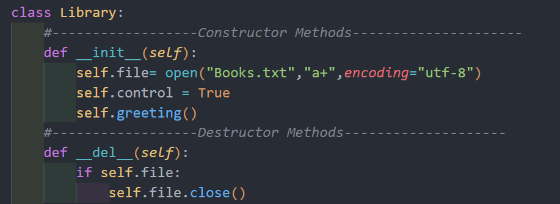
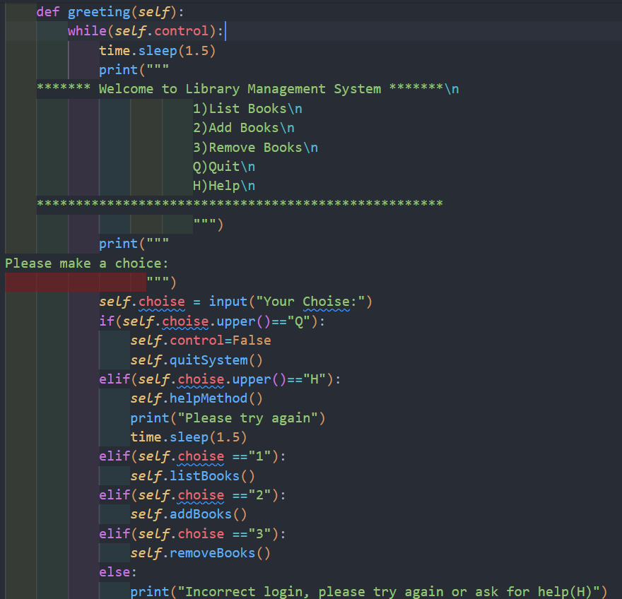
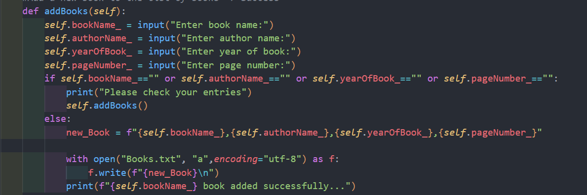
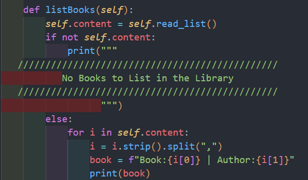
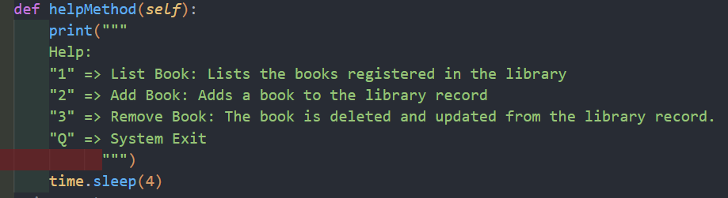
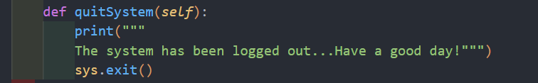

# Akbank-Python-Bootcamp
## Library Management System 

**Constructive and destructive method for library management system.**

**Help method for library management system**

**Method of adding books to the list for library management system**

**Listing method of books in the system for the library management system**

**Method for deleting books in the system for the library management system**

**Logout method for library management system**

